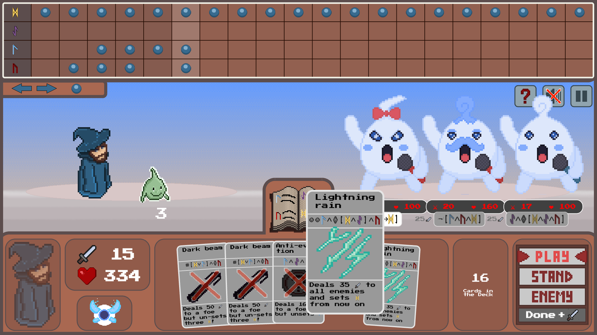

# Tempus fugit

**Tempus fugit** is a card-based combat game around concepts of *linear temporal logic* (LTL).

Play on: <https://tempusfugit.equiv.io/>

[](https://tempusfugit.equiv.io/)

## Gameplay

The core mechanic of *Tempus fugit* is to combat enemies with spell cards based on the strategic distribution of runes (variables) in successive rounds.
The assignments enable or disable temporal conditions for various actions.
The conditions are expressed in [LTL](https://en.wikipedia.org/wiki/Linear_temporal_logic), one of the most widely used temporal logics in computer science.

Specifically all of the player’s spell cards are subject to a logical condition that may depend on past or future rune assignments relative to the combat round.
The same is true for enemy abilities.

## How to build

The game has been developed with the [Phaser 3 Game Framework](https://phaser.io/) and TypeScript.
You can run it locally using `npm` after cloning the repository:

```
npm install
npm run dev
```

## Credits

Tobias Loch (software lead dev), Mustafa Mohsen (dev & inspiration), Florian Eyert (dev), Kejni Dema (dev), Maximilian Lukas Stamm (product management, card design, art), Alessio Nicolo Perna (scrum, devops & art), [Benjamin Bisping](https://bbisping.de) (additional software dev & coordination), Malek El-Tannir (music).